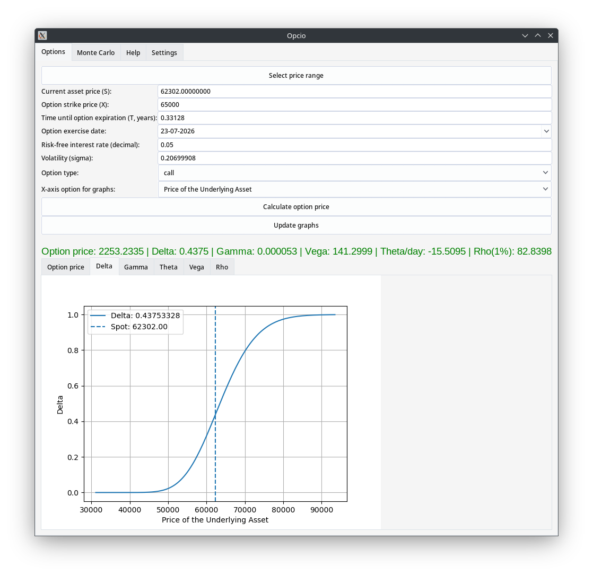
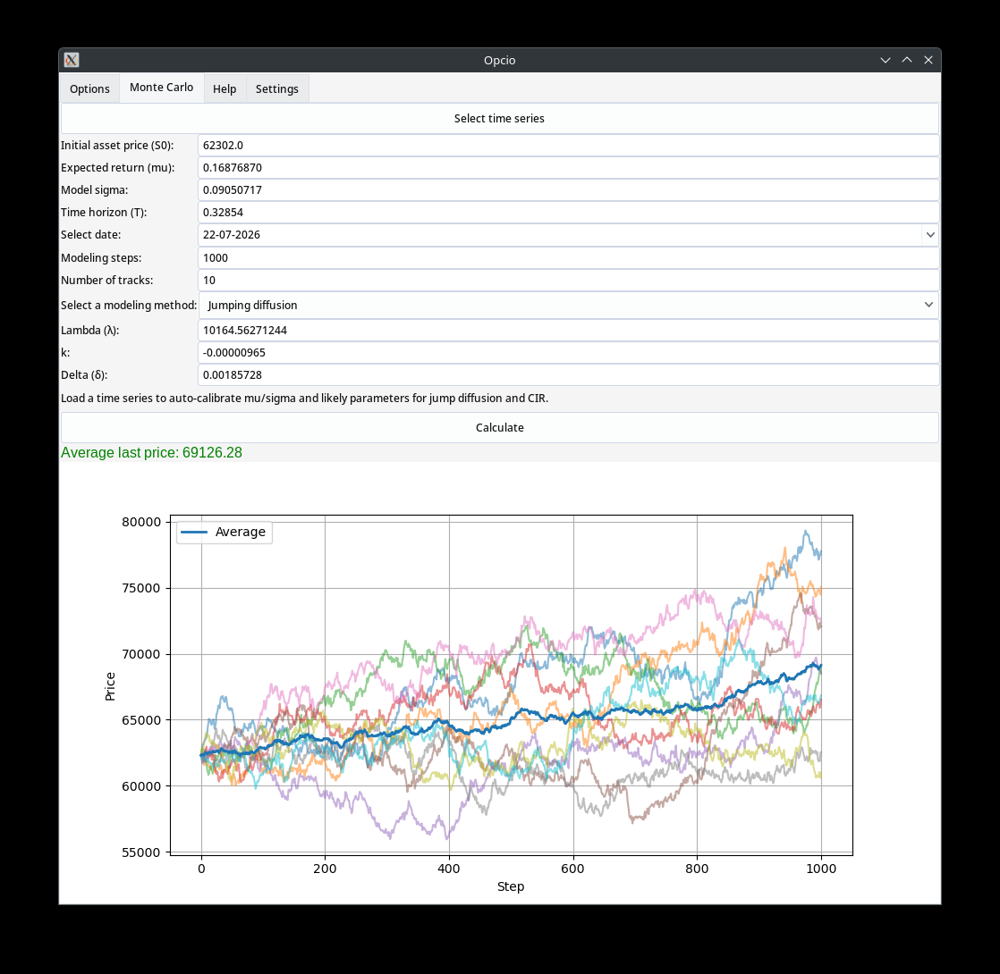
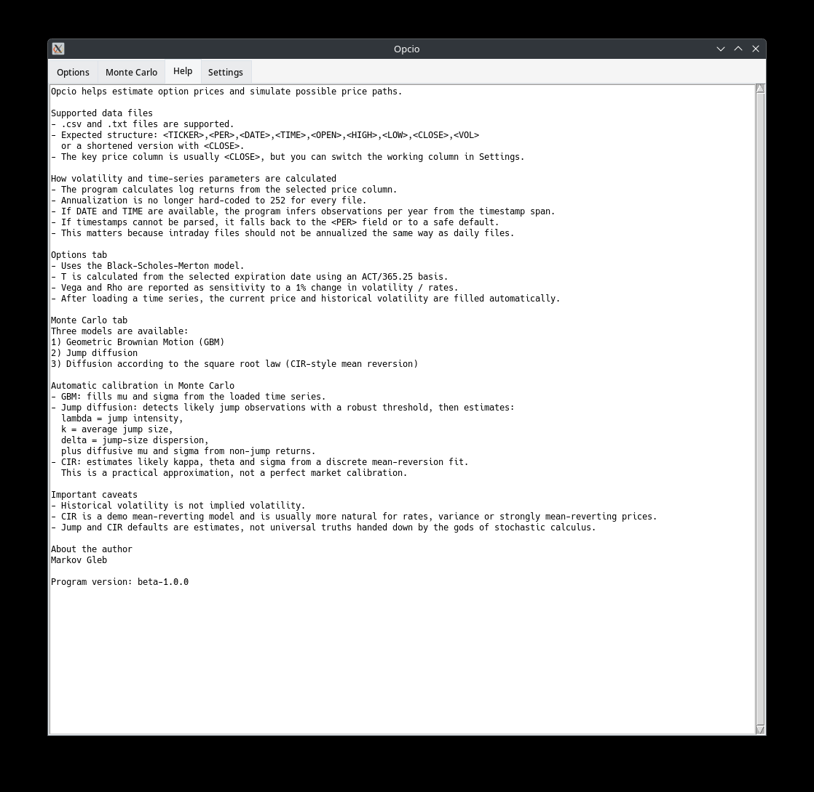
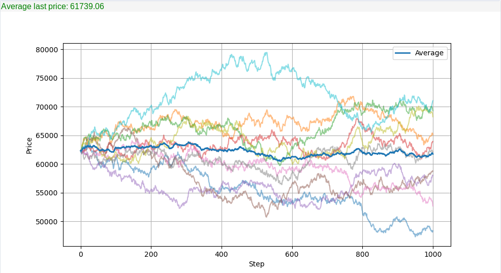

# Opcio

A desktop application for option pricing and Monte Carlo simulation of the underlying asset price.

Opcio was built as a research and educational project focused on quantitative finance workflows: option pricing with the Black-Scholes-Merton model, option Greeks, historical volatility estimation, and Monte Carlo simulation using several stochastic processes.

## Features

- **Option pricing** using the Black-Scholes-Merton model
- **Option Greeks**: Delta, Gamma, Vega, Theta, Rho
- **Historical volatility estimation** from a price series
- **Monte Carlo simulation** with:
  - Geometric Brownian Motion (GBM)
  - Jump Diffusion
  - Square-root diffusion (CIR-like process)
- **CSV and TXT input support** for price series files
- **Multiple GUI themes**
- **Built-in Help tab** with usage and model descriptions
- **NixOS-friendly development setup**

## Project structure

```text
app/
├── domain/
│   ├── greeks.py
│   ├── option_pricing.py
│   ├── simulation.py
│   └── volatility.py
├── services/
│   └── csv_loader.py
├── ui/
│   ├── app.py
│   ├── help_tab.py
│   ├── monte_carlo_tab.py
│   ├── options_tab.py
│   └── settings_tab.py
└── models.py
main.py
```

## Input data format

Supported file formats:

- `.csv`
- `.txt`

Supported structures:

```text
<TICKER>,<PER>,<DATE>,<TIME>,<OPEN>,<HIGH>,<LOW>,<CLOSE>,<VOL>
```

or

```text
<TICKER>,<PER>,<DATE>,<TIME>,<CLOSE>
```

The key column is **`<CLOSE>`**, which is used to estimate returns and volatility.

## Screenshots

## Screenshots

### Options tab


### Monte Carlo tab


### Help tab


### Example result


## Running on NixOS

A working NixOS workflow is described in detail in [`docs/NIXOS_RUN.md`](docs/NIXOS_RUN.md).

Short version:

```bash
nix-shell
mkdir -p .pylibs
python -m pip install --target ./.pylibs tkcalendar ttkthemes
PYTHONPATH=./.pylibs python main.py
```

## Running on a regular Linux environment

Install the required dependencies:

```bash
pip install numpy pandas scipy matplotlib mplcursors tkcalendar ttkthemes
```

Then run:

```bash
python main.py
```

## Methodology

Detailed notes are provided here:

- [`docs/METHODOLOGY.md`](docs/METHODOLOGY.md)
- [`docs/LIMITATIONS.md`](docs/LIMITATIONS.md)

## Limitations

This project is intended for educational and research purposes.

Key limitations:

- historical volatility is not a substitute for implied volatility;
- Jump Diffusion calibration is heuristic, not MLE-based;
- the square-root diffusion model is included as an experimental mean-reverting process;
- the application is **not** a trading system and should not be used as a production pricing engine.

## Why this project matters

This repository demonstrates:

- decomposition of a legacy monolithic GUI application into a layered structure;
- implementation of pricing and simulation models from quantitative finance;
- practical work with stochastic processes, returns, annualization, and calibration heuristics;
- packaging and reproducible setup for NixOS.

## Author

**Gleb Markov**

## License

This repository is distributed under the MIT License.
See [`LICENSE`](LICENSE).
